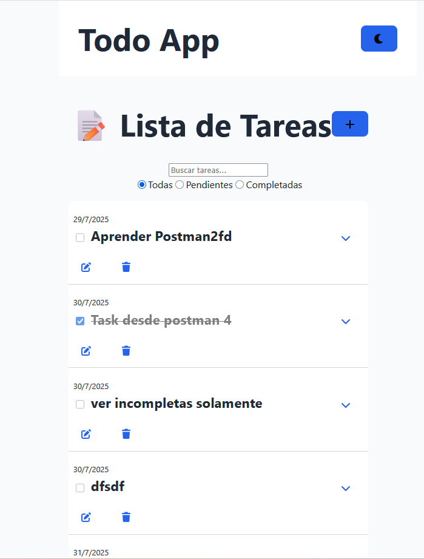
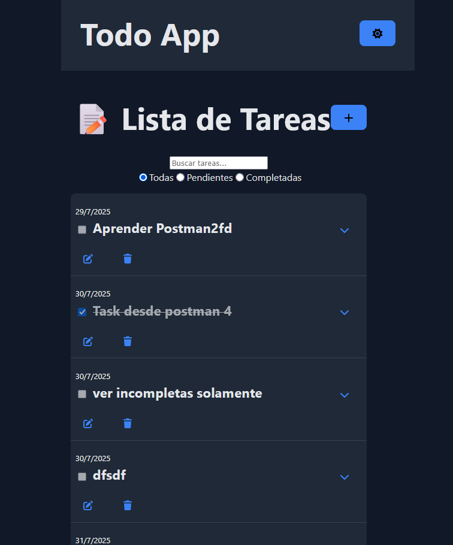
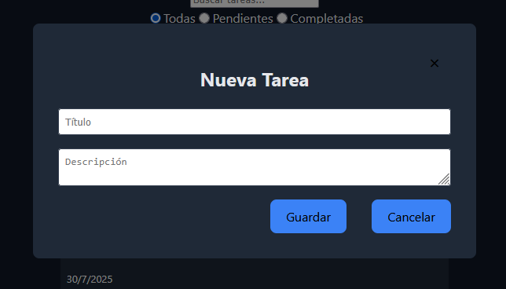
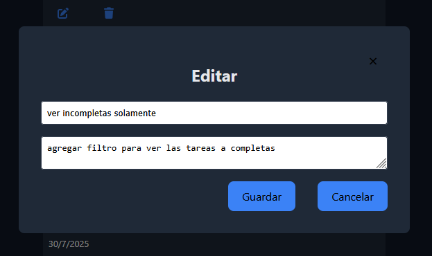

# TodoApp-nodeJs-React-ForIT

Una aplicación full-stack para gestionar tareas, desarrollada con **React + Vite** en el frontend y **Node.js + Express + SQLite3** en el backend. Permite crear, editar, eliminar, buscar y filtrar tareas.

---

## 🚀 Características

- ✅ Crear, editar y eliminar tareas
- 🔍 Buscar por texto con debounce
- 📂 Filtrar por estado: todos, completados, pendientes
- 🎨 Cambio de tema claro/oscuro
- ⚡️ Frontend con React + Vite
- 🔧 Backend con Express + SQLite3

---

## 📸 Screenshots

### Modo claro



### Modo oscuro



### Formularios





---

## 🛠️ Requisitos

- Node.js >= 18
- npm

---

## 🧪 Instalación y ejecución local

### 1. Clonar el repositorio

```bash
git clone https://github.com/CoronelDalma/TodoApp-nodeJs-React-ForIT.git
cd TodoApp-nodeJs-React-ForIT
```

### 2. Instalar dependencias del backend
```bash
cd backend
npm install
```
### 3. Ejecutar backend
```bash
npm run dev
```

### 4. Instalar dependencias del frontend
```bash
cd ../frontend
npm install
```

### 5. Ejecutar frontend
```bash
npm run dev
```

## API Endpoints

GET /api/tasks → Todas las tareas

GET /api/tasks/:id → Tarea especifica

GET /api/tasks?completed=true|false → Filtrar por estado

GET /api/tasks?search=texto → Buscar por texto

POST /api/tasks → Crear tarea

PUT /api/tasks/:id → Editar tarea

PATCH /api/tasks/:id/complete → Marcar tarea como completada

DELETE /api/tasks/:id → Eliminar tarea
